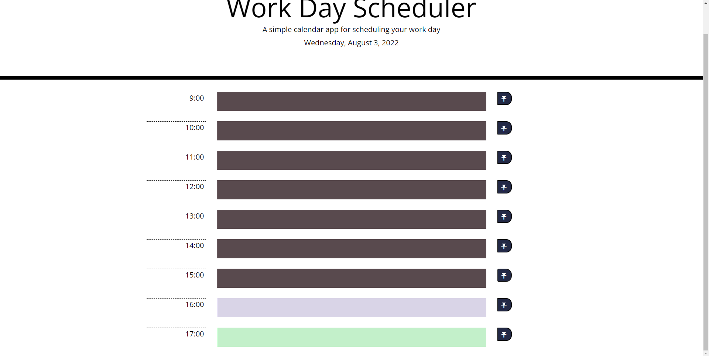
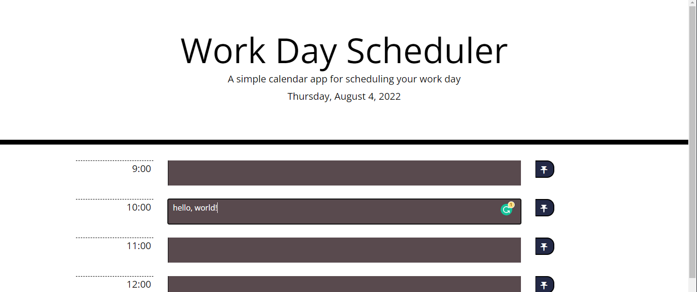

# Module #5 Challenge: Work Day Scheduler

## Description
This project is a **simple calendar application challenge**. This challenge allows a user to save events for each hour of the day. This app runs in the browser and features dynamically updated HTML and CSS powered by jQuery, and uses ***Moment.js*** to work with date and time. It has a clean and responsive interface.

Implemented features:

* when the user open the planner, the current day is displayed at the top of the page
* when scrolling down, the user is presented with time blocks for standard business hours
* when viewing the time blocks for the day, each time-block is color-coded to indicate whether it is in the past, present, or future
* when the user clicks on a time block, they can enter an event
* when the user enters an event, they can click the corresponding save button for that time block
* when the corresponding save button is clicked, then the text is stored in `localStorage`
* when the page refreshes, the saved events persist

In addition, I have:

* deployed the live [URL](https://desguerra.github.io/work-day-scheduler/)
* modified the application to resemble the mock-up functionality

Here is the link to [the completed challenge!](https://desguerra.github.io/work-day-scheduler/)

## Table of Contents

* [Screenshots](#screenshots)
* [Credits](#credits)
* [Badges](#badges)

## Screenshots

## Credits

* Starter code cloned from [here!](https://github.com/coding-boot-camp/super-disco)
* [Moment.js](https://momentjs.com/) library

## Badges

